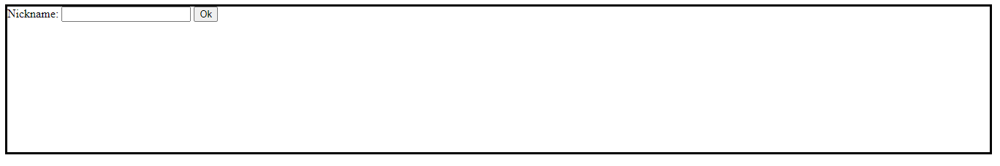
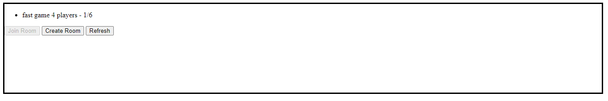
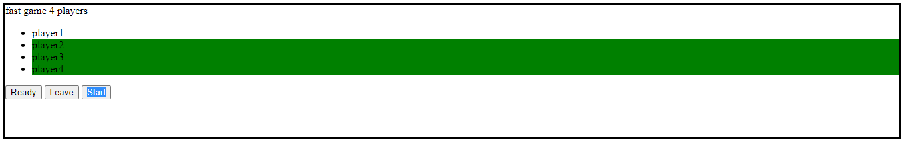
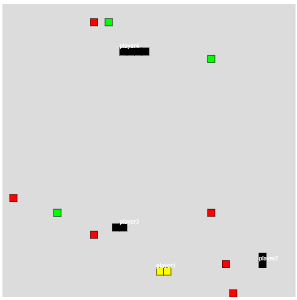

# snake101-arena
A multiplayer HTML5 game, runs on Java server under Spring Framework

### Project Definition

This project is a basic Java [Spring Boot](https://spring.io/projects/spring-boot) application. It is a multiplayer version of classical snake game where two to eight players can play together. 
In client-side, to communicate with server [SockJS](https://github.com/sockjs/sockjs-client) and [STOMP.js](https://github.com/stomp-js/stompjs) are used. 
In this project, [AngularJS](https://angularjs.org/) is essential client-side framework to create dynamic single page web application. 
To manipulate HTML5 elements and make fluent game graphics, [p5.js](https://p5js.org/) is used. Thus, a sketch -game screen- can be provided.

### How to Play

Each player starts the game as a one piece snake and grows by eating green blocks. The moving action is easily controlled by arrow keys.
Players should move towards green blocks and avoid from red blocks and other players.

### Deployment

The game is deployed on the heroku server and is ready to play.

https://snake101-arena.herokuapp.com/

### Screenshots

